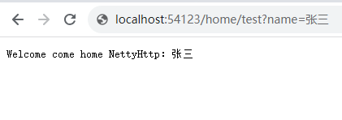

# Netty-Blink
## 简介
基于 `Netty4` 实现的快速、轻量级 `WEB` 框架。
```text
                    
                     ▄▄▄▄       ██▓        ██▓    ███▄    █     ██ ▄█▀
                    ▓█████▄    ▓██▒       ▓██▒    ██ ▀█   █     ██▄█▒ 
                    ▒██▒ ▄██   ▒██░       ▒██▒   ▓██  ▀█ ██▒   ▓███▄░ 
                    ▒██░█▀     ▒██░       ░██░   ▓██▒  ▐▌██▒   ▓██ █▄ 
                    ░▓█  ▀█▓   ░██████▒   ░██░   ▒██░   ▓██░   ▒██▒ █▄
                    ░▒▓███▀▒   ░ ▒░▓  ░   ░▓     ░ ▒░   ▒ ▒    ▒ ▒▒ ▓▒
                    ▒░▒   ░    ░ ░ ▒  ░    ▒ ░   ░ ░░   ░ ▒░   ░ ░▒ ▒░
                     ░    ░      ░ ░       ▒ ░      ░   ░ ░    ░ ░░ ░ 
                     ░             ░  ░    ░              ░    ░  ░   
                          ░                                           
```

## 快速启动

### 启动类
```java
public class App {

    public static void main(String[] args) throws Exception {
        BlinkServer.start(App.class) ;
    }
}
```

### 配置接口
```java
@BlinkController("/home")
public class HomeRoute {

    @BlinkMethod("/test")
    public String home(String name) {
        return "Welcome come home NettyHttp：" + name;
    }
}
```
启动访问 http://localhost:54123/home?name=张三


### 说明
```java
@BlinkController 注解定义的接口的根路径，@BlinkMethod定义了方法的访问路径；
此项目为一个简单的 Http Web 框架轮子，其中可以拓展项很多，比如：过滤器、Body传参、Cookie、文件上传等等...
```